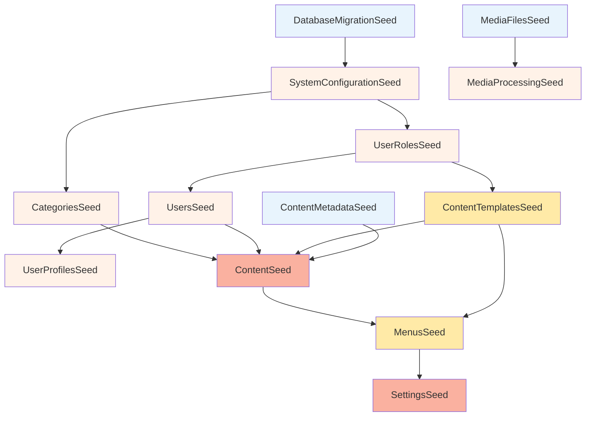

# DataSeeding Demo

This demo shows how to use the `Neolution.Extensions.DataSeeding` library with a Content Management System (CMS) seeding scenario. It demonstrates dependency resolution with 13 interconnected seeds.

## Overview

The demo creates a fictional CMS environment with seeds that handle everything from database setup to final configuration. It shows how the framework manages dependency chains while keeping code organized.

## What Gets Seeded

The seeds follow a technical dependency hierarchy:



- **Independent** (Light Blue): No dependencies, can run first
- **Single Dependency** (Light Orange): Depend on exactly one other seed
- **Multiple Dependencies** (Light Yellow): Depend on 2+ seeds at same level
- **Deep Dependencies** (Light Red): Depend on seeds that themselves have dependencies

## Key Features Demonstrated

### 1. Complex Multi-Dependencies

The `ContentSeed` shows how a single seed can depend on multiple other seeds:

```csharp
[DependsOn(typeof(CategoriesSeed), typeof(UsersSeed), 
          typeof(ContentTemplatesSeed), typeof(ContentMetadataSeed))]
public class ContentSeed : ISeed
{
    // Implementation
}
```

### 2. Shared Dependencies

`ContentTemplatesSeed` is used by both `ContentSeed` and `MenusSeed`, showing how seeds can be shared across different parts of the system.

### 3. Sequential Execution

Seeds are executed sequentially in dependency order. Independent seeds (those with no dependencies) like `DatabaseMigrationSeed`, `MediaFilesSeed`, and `ContentMetadataSeed` can be processed first, but the framework executes them one by one to maintain consistency.

### 4. Realistic Timing

Each seed includes delays to simulate actual database operations, file processing, and API calls.

## Running the Demo

### Prerequisites

- .NET 8.0 or later
- Visual Studio 2022 or VS Code

### Quick Start

```bash
# Navigate to the demo project
cd Neolution.Extensions.DataSeeding.Demo

# Run the initialization command
dotnet run init
```

## Code Structure

### Seed Implementation Pattern

Each seed follows a consistent pattern:

```csharp
[DependsOn(typeof(DependencySeed))]
public class ExampleSeed : ISeed
{
    private readonly ILogger<ExampleSeed> logger;

    public ExampleSeed(ILogger<ExampleSeed> logger)
    {
        this.logger = logger;
    }

    public async Task SeedAsync()
    {
        this.logger.LogInformation("Starting seed operation...");
        await Task.Delay(200); // Simulate work
        this.logger.LogInformation("Seed operation completed");
    }
}
```

### Dependency Injection Setup

The demo uses standard .NET dependency injection configured in `Startup.cs`:

```csharp
public void ConfigureServices(IServiceCollection services)
{
    services.AddDataSeeding();
    // Additional service registrations...
}
```

**Note**: The parameterless `AddDataSeeding()` method automatically detects seeds in the calling assembly. For cross-assembly scenarios, use `AddDataSeeding(assembly)`.

## What You'll Learn

By studying this demo, you'll understand:

1. **Dependency Management**: How to structure seeds with complex interdependencies
2. **Execution Order**: How the framework automatically resolves and orders seed execution
3. **Real-World Patterns**: Practical examples of data seeding in applications
4. **Performance**: How the framework handles execution timing

## Extending the Demo

You can easily add your own seeds by:

1. Creating a new class implementing `ISeed`
2. Adding `[DependsOn(typeof(...))]` attributes for dependencies  
3. Implementing the `SeedAsync()` method
4. Running the demo to see your seed in the execution order

The framework will automatically detect and include your new seeds in the dependency resolution process.

---

**Need Help?** Check the main library documentation or explore the seed implementations in the `Commands/Init/Seeds/` directory for detailed examples.
